# Hojo Memory Engine

**English** | [中文](./README.zh-CN.md)

**Schema-first memory infrastructure for Personal Agents.**

Hojo Memory Engine is a long-term memory layer for AI agents. It turns context scattered across conversations, documents, meetings, and business systems into **memory assets** that are definable, retrievable, referenceable, and governable.

In agent applications, model capabilities and toolchains can be swapped—but what keeps compounding is the context accumulated between users and agents over time. **Memory is the new moat.**

## Why Hojo Memory Engine

Many agent demos appear to “have memory,” but real workflows expose a gap:

- Agents remember things, yet struggle to explain *why* something was stored, *how* it updates, or *when* it expires.
- RAG / vector search can surface relevant snippets, but cannot reliably express “this user’s budget, preferences, relationships, state, permissions, and business rules.”
- Simple memory middleware can read and write, but schema, permissions, audit, rollback, billing, and long-term governance are left to product teams.
- As agents move from toys to production, memory becomes a system asset. Without definition and governance, smarter agents mean harder-to-control risk.

The table below compares common approaches from a **user and product-team perspective** (source: [internal design doc](https://k0z3fcmwg0v.feishu.cn/docx/MPHJdPT0OoSIBoxbiFEcWPlEnag)):

| Dimension | Hojo Memory Engine | MemoryOS (BUPT OSS) | mem0 | RAG / vector DB |
| --- | --- | --- | --- | --- |
| **Best fit** | Teams building production Personal Agents that need long-term, governable user memory | Research or tiered-memory experiments with fixed short / mid / long layers | Teams that need quick memory read/write inside chat flows | Q&A over documents; not a user memory product |
| **Define what to remember** | Product defines memory fields (budget, goals, preferences, status) via schema — add fields without redeploying agent logic | Fixed memory tiers; hard to align with your product’s field model | Mostly unstructured blobs; weak support for business-level field semantics | No per-user memory model; only document chunks |
| **Day-to-day experience** | Natural language → parse → store → inject into prompts; Dashboard for schema, keys, and user data | You wire low-level APIs and orchestration yourself | Fast PoC with simple APIs; high-level parse / call flows are DIY | You own ingestion, updates, and prompt injection end to end |
| **Trust & explainability** | Clear write/retrieve/call rules, versioning, audit, and governance with rollback | Limited visibility into why data was stored or how to correct it | Hard to explain why a memory exists, when it updates, or when it expires | Retrieval only — no durable memory lifecycle to audit |
| **Production & operations** | Multi-tenant auth, permissions, billing, Dashboard, and long-term memory governance (Dreaming) | No dashboard, billing, or enterprise permission model | Middleware — platform, ops, and governance are your responsibility | Search infrastructure — you build the product layer around it |

The core thesis is simple:

**Memory cannot be just a pile of model-generated text fragments. Memory should be a system layer agents can depend on.**

## What It Does

Hojo Memory Engine provides an end-to-end path from schema definition to memory invocation:

- **Schema-first memory model** — Define what to remember, value types, write/retrieve/call behavior, then let models parse and update.
- **Multi-mode retrieval** — `EXACT`, `REGEX`, `SEMANTIC`, and `LLM` for deterministic fields, pattern match, semantic recall, and model judgment.
- **Parse / Retrieve / Call rules** — Versioned rules instead of implicit business logic buried in prompts.
- **Python / Java SDK** — Integrate memory write, read, and call from agents, apps, and backend services.
- **Dashboard and governance** — Manage schemas, API keys, user data, governance proposals, Dreaming jobs, and billing events.
- **Production-oriented backend** — FastAPI with MySQL, MongoDB, Qdrant, Redis, Kafka, Temporal; multi-tenant, permissions, and audit extensions.

## Architecture

Hojo Memory Engine sits between agent applications and underlying data / model infrastructure. It does not replace models or business systems—it turns reusable long-term context into a stable memory layer for agents.



The system includes API, schema management, storage, vector search, rule execution, governance orchestration, and Dashboard.



## Core Concepts

### Schema

A schema defines a memory field (e.g. customer budget, user age, location, long-term goal):

- Field name and description
- Value type
- Write mode: `OVERWRITE` / `APPEND` / `MERGE`
- Storage: `KV` / `VECTOR` / `KV_AND_VECTOR`
- Parse, retrieve, and call rules

Schema is the “table structure” and “usage spec” of agent memory. Without it, memory devolves into opaque fragments.

### Data

Data is the actual memory for a user and field. It can be written directly or parsed from natural language via LLM.

Typical flow:

```text
raw input -> parse rule -> memory data -> retrieve rule -> prompt call
```

### Retrieve Rule

| Mode | Use case |
| --- | --- |
| `EXACT` | Known field name, direct read |
| `REGEX` | Pattern-based field match |
| `SEMANTIC` | Vector recall of semantically similar memory |
| `LLM` | Model picks memory from field description or context |

### Dreaming / Governance

Dreaming runs background jobs to analyze memory quality, find merge/fix candidates, and produce governance proposals. Approved proposals flow back through Schema / Data APIs—keeping long-term memory auditable instead of a black box.

## Quick Start

### 1. Clone and configure

```bash
git clone <repo-url>
cd hojoai-omniasst-memoryOS
cp .env.example .env
```

Local development requires:

- Python 3.12+
- Node.js 18+
- MySQL, Redis, MongoDB, Qdrant

For LLM parsing, configure an OpenAI-compatible endpoint in `.env`:

```bash
OPENAI_BASE_URL=https://api.openai.com/v1
OPENAI_API_KEY=your_api_key
OPENAI_MODEL=gpt-4o-mini
```

### 2. Start backend

```bash
cd backend
uv sync
export APP_DISABLE_AUTH=true
uv run uvicorn memory_engine.main:app --reload --host 0.0.0.0 --port 6030
```

API base URL:

```text
http://127.0.0.1:6030/api/v1
```

### 3. Start dashboard

```bash
cd dashboard
npm install
npm run dev
```

The dashboard manages schemas, API keys, user data, and governance.



### 4. Run migrations and seed data

```bash
mysql -h 127.0.0.1 -u root memory_engine < backend/migrations/mysql/001_initial_schema.sql
mysql -h 127.0.0.1 -u root memory_engine < backend/migrations/mysql/002_seed_dev.sql
```

Dev seed API key:

```bash
export MEMORY_ENGINE_API_KEY=mos_devtest00001ab
```

## SDK Usage

### Python

Install the local SDK:

```bash
cd sdk/python
uv pip install -e .
```

Configure:

```bash
export MEMORY_ENGINE_API_BASE=http://127.0.0.1:6030/api/v1
export MEMORY_ENGINE_API_KEY=mos_devtest00001ab
export MEMORY_ENGINE_TENANT_ID=1
export MEMORY_ENGINE_ORG_ID=1
```

Basic example:

```python
from memory_engine_sdk import Data, ParseInput, Schema, SEARCHENUM

schema = Schema.getOrCreate("用户年龄", SEARCHENUM.EXACT)
mem = Data.parse(schema.name, ParseInput("我今年25岁"))
row = Data.get(schema.name)
text = Data.call(
    schema.name,
    "用户<年龄>岁，能否考驾照？",
    "<年龄>",
    row.data if row else {},
    use_llm=False,
)
print(text)
```

LLM parse rule:

```python
from memory_engine_sdk import Data, ParseInput, Schema

Schema.llm_parse(
    "用户性别",
    "extract_gender",
    "从用户输入中抽取「{field}」，只输出 JSON：{\"value\": \"男|女|未知\"}。\n\n用户输入：{text}",
    model="gpt-4o-mini",
    llm_params={"temperature": 0.1, "top_p": 0.9},
    system="只输出合法 JSON。",
)

mem = Data.parse(
    "用户性别",
    ParseInput("我是男的，今天天气怎么样"),
    parse_rule_name="extract_gender",
)
```

More:

- [`sdk/python/README.md`](./sdk/python/README.md)
- [`examples/sdk_llm_parse.py`](./examples/sdk_llm_parse.py)

### Java

Build:

```bash
cd sdk/java
mvn -q clean package
```

Basic example:

```java
import com.memoryengine.MemoryEngine;
import com.memoryengine.enums.SearchEnum;
import com.memoryengine.model.ParseInput;

public class Example {
  public static void main(String[] args) throws Exception {
    MemoryEngine client = MemoryEngine.fromEnvironment();

    var schema = client.schema().getOrCreate("用户年龄", SearchEnum.SEMANTIC, null);
    var mem = client.data().parse(schema.name(), new ParseInput("我今年25岁"));

    String filled = client.data().call(
        schema.name(),
        "用户<年龄>岁，能否考驾照？",
        "<年龄>",
        mem.data(),
        null,
        false);

    System.out.println(filled);
  }
}
```

More:

- [`sdk/java/README.md`](./sdk/java/README.md)

## Deployment

### Docker

API and Dashboard share the root `Dockerfile`. Use `MEMORY_ENGINE_ROLE` to select the process:

```bash
docker build -t memory-engine:latest .

docker run --rm \
  -e MEMORY_ENGINE_ROLE=api \
  -p 6030:6030 \
  memory-engine:latest

docker run --rm \
  -e MEMORY_ENGINE_ROLE=dashboard \
  -p 8080:80 \
  memory-engine:latest
```

API-only image:

```bash
docker build --target api -t memory-engine-api:latest .
```

### Kubernetes

```bash
envsubst < k8s-Deployment.yaml | kubectl apply -f -
```

See [`deploy/README.md`](./deploy/README.md) and [`k8s-Deployment.yaml`](./k8s-Deployment.yaml).

## Optional Runtime Components

### Temporal Worker

Temporal orchestrates Dreaming and other workflows.

```bash
cd infra/docker-compose
docker compose up -d temporal temporal-ui

cd ../../backend
uv run memory-engine-worker
```

### Kafka Consumers

Kafka handles schema changelog and billing events.

```bash
cd infra/docker-compose
docker compose up -d kafka
```

Enable in API:

```bash
KAFKA_CONSUMERS_ENABLED=true
```

## Environment Variables

| Variable | Description |
| --- | --- |
| `MYSQL_*` | MySQL connection |
| `REDIS_*` | Redis connection |
| `MONGODB_*` | MongoDB connection |
| `QDRANT_URL` | Qdrant API root |
| `OPENAI_*` | OpenAI-compatible LLM |
| `APP_DISABLE_AUTH` | Skip API auth (local dev only) |
| `ADMIN_BOOTSTRAP_SECRET` | Admin bootstrap secret |
| `MEMORY_ENGINE_API_BASE` / `MEMORY_ENGINE_API_KEY` | SDK connection |
| `KAFKA_CONSUMERS_ENABLED` | Schema / billing consumers |
| `TEMPORAL_*` | Temporal worker |

Full list: [`.env.example`](./.env.example).

## Where It Fits in Hojo

Hojo Memory Engine is the memory layer of the Hojo stack:

- **CRSPY** captures real work context from daily workflows.
- **Hojo Memory Engine** turns context into structured, governed memory assets.
- **Hojo AgenticOS** uses memory, tools, and models for long-running agent behavior.
- **Hojo Omni** handles multimodal understanding and interaction.

Together, these layers move Personal Agents from one-shot replies toward long-term, context-aware execution.

## Documentation

- [User Guide](./docs/user-guide.md)
- [HTTP API Reference](./docs/API.md)
- [Python SDK](./sdk/python/README.md)
- [Java SDK](./sdk/java/README.md)
- [Backend Guide](./backend/README.md)
- [Project Structure](./PROJECT_STRUCTURE.md)
- [Deployment](./deploy/README.md)
- [Contributing](./CONTRIBUTING.md)
- [Security](./SECURITY.md)

## License

Apache License 2.0. See [LICENSE](./LICENSE).
