# Hojo Memory Engine

[English](./README.md) | **中文**

**面向 Personal Agent 的 Schema-first 记忆基础设施。**

Hojo Memory Engine 是为 AI Agent 设计的长期记忆层。它把分散在对话、文档、会议、业务系统里的上下文，沉淀成可定义、可检索、可引用、可治理的 **memory asset**。

在 Agent 应用里，模型能力可以替换，工具链可以替换，真正会持续变厚的是用户与 Agent 之间长期积累的 context。**Memory is the new moat.**

## 为什么选择 Hojo Memory Engine

现在很多 Agent Demo 看起来已经“有记忆”了，但一进入真实工作流，就会出现一层落差：

- Agent 记住了一些内容，却很难解释它为什么记住、如何更新、何时失效。
- RAG / 向量检索能找回相关片段，但无法稳定表达「这个用户的预算、偏好、关系、状态、权限、业务规则分别是什么」。
- 简单 memory middleware 能写入和读取记忆，但 schema、权限、审计、回滚、计费、长期治理通常留给业务方自己补。
- 当 Agent 从个人玩具进入生产环境，记忆会变成系统资产。没有定义权和治理权，Agent 越聪明，风险越难控。

下表从**使用方与业务团队**视角对比常见方案（内容参考 [内部设计文档](https://k0z3fcmwg0v.feishu.cn/docx/MPHJdPT0OoSIBoxbiFEcWPlEnag) 中的行业对比）：

| 维度 | Hojo Memory Engine | MemoryOS（北邮开源） | mem0 | RAG / 向量库 |
| --- | --- | --- | --- | --- |
| **适合谁 / 典型场景** | 要做可上线、可长期运营的 Personal Agent，需要稳定用户记忆 | 研究或实验性分层记忆（固定 short / mid / long） | 对话类产品快速接入记忆读写 | 文档问答；不是面向用户的记忆产品 |
| **能否自定义「记什么」** | 业务侧通过 Schema 定义字段（预算、目标、偏好、状态等），新增字段不必改 Agent 代码 | 分层结构固定，难与产品字段模型对齐 | 多为非结构化片段，业务语义表达弱 | 无用户级记忆模型，只有文档片段 |
| **日常使用体验** | 自然语言解析 → 写入 → 填入 prompt；Dashboard 管理 Schema、Key 与用户数据 | 需自行拼装低阶 API 与编排逻辑 | API 简单、PoC 快；解析与引用等高阶流程需自建 | 检索链路需自行打通，记忆生命周期全靠自己 |
| **可控与可解释** | 写入 / 检索 / 引用规则清晰，支持版本、审计与可回滚的治理流程 | 难解释「为何记住」「如何纠错」 | 难说明记忆来源、更新时机与失效策略 | 仅做召回，无持久记忆可供审计 |
| **上线与长期运营** | 多租户鉴权、权限、计费、Dashboard、长期记忆治理（Dreaming） | 无 Dashboard、计费与企业级权限 | 中间件定位，平台化与运维需自行建设 | 搜索基础设施，产品层需全部自研 |

Hojo Memory Engine 的核心判断很简单：

**记忆不能只是一堆被模型生成的文本片段。记忆应该成为 Agent 可依赖的系统层。**

## 能做什么

Hojo Memory Engine 提供一套从 schema 定义到记忆调用的完整链路：

- **Schema-first 记忆模型** — 先定义要记什么、值类型、如何写入/检索/调用，再让模型参与解析和更新。
- **多模式检索** — 支持 `EXACT`、`REGEX`、`SEMANTIC`、`LLM`，覆盖确定字段、规则匹配、语义相似和模型判断。
- **Parse / Retrieve / Call 规则** — 把解析、检索、引用逻辑沉淀成可版本化的规则，减少散落在 prompt 里的隐性业务逻辑。
- **Python / Java SDK** — Agent、App、后端服务可直接接入记忆写入、读取和调用。
- **Dashboard 与治理** — Schema、API Key、用户数据、治理提案、Dreaming 任务、计费事件等管理入口。
- **面向生产的后端** — FastAPI，连接 MySQL、MongoDB、Qdrant、Redis、Kafka、Temporal，支持多租户、权限与审计扩展。

## 架构

Hojo Memory Engine 位于 Agent 应用和底层数据 / 模型基础设施之间。它不替代模型，也不替代业务系统；它负责把可长期复用的 context 变成 Agent 能稳定使用的记忆层。



系统侧由 API、Schema 管理、数据存储、向量检索、规则执行、治理编排和 Dashboard 组成。



## 核心概念

### Schema

Schema 定义一个记忆字段，例如「客户预算」「用户年龄」「居住地」「长期目标」。它决定：

- 字段名称与描述
- 值类型
- 写入方式：`OVERWRITE` / `APPEND` / `MERGE`
- 存储方式：`KV` / `VECTOR` / `KV_AND_VECTOR`
- 解析规则、检索规则、调用规则

大白话讲，Schema 是 Agent 记忆里的「表结构」和「使用说明」。没有 Schema，记忆就容易变成模型自己猜的一堆碎片。

### Data

Data 是某个用户、某个字段下的实际记忆数据。它可以由业务直接写入，也可以由 LLM 从自然语言里解析出来。

典型链路：

```text
raw input -> parse rule -> memory data -> retrieve rule -> prompt call
```

### Retrieve Rule

Retrieve Rule 决定如何找回记忆：

| 模式 | 适用场景 |
| --- | --- |
| `EXACT` | 已知字段名，直接读取 |
| `REGEX` | 按规则匹配字段 |
| `SEMANTIC` | 用向量召回语义相近的记忆 |
| `LLM` | 让模型根据字段描述或上下文判断应该使用哪段记忆 |

### Dreaming / Governance

Dreaming 是后台治理任务，用来分析记忆质量、发现可合并或可修复的记忆，并生成治理提案。治理提案进入审核流程后，再回写到 Schema / Data API。

这条链路把 Agent 的长期记忆纳入审核、整理、升级和审计流程，避免记忆在长期使用中变成不可解释的黑箱。

## 快速开始

### 1. 克隆与配置

```bash
git clone <repo-url>
cd hojoai-omniasst-memoryOS
cp .env.example .env
```

本地开发需要：

- Python 3.12+
- Node.js 18+
- MySQL、Redis、MongoDB、Qdrant

若要测试 LLM 解析，在 `.env` 中配置 OpenAI 兼容接口：

```bash
OPENAI_BASE_URL=https://api.openai.com/v1
OPENAI_API_KEY=your_api_key
OPENAI_MODEL=gpt-4o-mini
```

### 2. 启动后端

```bash
cd backend
uv sync
export APP_DISABLE_AUTH=true
uv run uvicorn memory_engine.main:app --reload --host 0.0.0.0 --port 6030
```

API 根地址：

```text
http://127.0.0.1:6030/api/v1
```

### 3. 启动 Dashboard

```bash
cd dashboard
npm install
npm run dev
```

Dashboard 用于管理 Schema、API Key、用户数据和治理流程。


### 4. 迁移与种子数据

```bash
mysql -h 127.0.0.1 -u root memory_engine < backend/migrations/mysql/001_initial_schema.sql
mysql -h 127.0.0.1 -u root memory_engine < backend/migrations/mysql/002_seed_dev.sql
```

开发种子 API Key：

```bash
export MEMORY_ENGINE_API_KEY=mos_devtest00001ab
```

## SDK 使用

### Python

安装本地 SDK：

```bash
cd sdk/python
uv pip install -e .
```

配置环境变量：

```bash
export MEMORY_ENGINE_API_BASE=http://127.0.0.1:6030/api/v1
export MEMORY_ENGINE_API_KEY=mos_devtest00001ab
export MEMORY_ENGINE_TENANT_ID=1
export MEMORY_ENGINE_ORG_ID=1
```

基础示例：

```python
from memory_engine_sdk import Data, ParseInput, Schema, SEARCHENUM

# 1. 定义或获取记忆 Schema
schema = Schema.getOrCreate("用户年龄", SEARCHENUM.EXACT)

# 2. 从自然语言解析为记忆数据
mem = Data.parse(schema.name, ParseInput("我今年25岁"))

# 3. 读取记忆
row = Data.get(schema.name)

# 4. 将记忆填入 prompt 模板
text = Data.call(
    schema.name,
    "用户<年龄>岁，能否考驾照？",
    "<年龄>",
    row.data if row else {},
    use_llm=False,
)
print(text)
```

LLM 解析规则示例：

```python
from memory_engine_sdk import Data, ParseInput, Schema

Schema.llm_parse(
    "用户性别",
    "extract_gender",
    "从用户输入中抽取「{field}」，只输出 JSON：{\"value\": \"男|女|未知\"}。\n\n用户输入：{text}",
    model="gpt-4o-mini",
    llm_params={"temperature": 0.1, "top_p": 0.9},
    system="只输出合法 JSON。",
)

mem = Data.parse(
    "用户性别",
    ParseInput("我是男的，今天天气怎么样"),
    parse_rule_name="extract_gender",
)
```

更多示例：

- [`sdk/python/README.md`](./sdk/python/README.md)
- [`examples/sdk_llm_parse.py`](./examples/sdk_llm_parse.py)

### Java

构建：

```bash
cd sdk/java
mvn -q clean package
```

基础示例：

```java
import com.memoryengine.MemoryEngine;
import com.memoryengine.enums.SearchEnum;
import com.memoryengine.model.ParseInput;

public class Example {
  public static void main(String[] args) throws Exception {
    MemoryEngine client = MemoryEngine.fromEnvironment();

    var schema = client.schema().getOrCreate("用户年龄", SearchEnum.SEMANTIC, null);
    var mem = client.data().parse(schema.name(), new ParseInput("我今年25岁"));

    String filled = client.data().call(
        schema.name(),
        "用户<年龄>岁，能否考驾照？",
        "<年龄>",
        mem.data(),
        null,
        false);

    System.out.println(filled);
  }
}
```

更多说明：

- [`sdk/java/README.md`](./sdk/java/README.md)

## 部署

### Docker

API 与 Dashboard 共用根目录 `Dockerfile`，通过 `MEMORY_ENGINE_ROLE` 选择进程：

```bash
docker build -t memory-engine:latest .

docker run --rm \
  -e MEMORY_ENGINE_ROLE=api \
  -p 6030:6030 \
  memory-engine:latest

docker run --rm \
  -e MEMORY_ENGINE_ROLE=dashboard \
  -p 8080:80 \
  memory-engine:latest
```

仅 API 镜像（跳过前端构建）：

```bash
docker build --target api -t memory-engine-api:latest .
```

### Kubernetes

```bash
envsubst < k8s-Deployment.yaml | kubectl apply -f -
```

详见 [`deploy/README.md`](./deploy/README.md) 与 [`k8s-Deployment.yaml`](./k8s-Deployment.yaml)。

## 可选运行时组件

### Temporal Worker

Temporal 用于编排与 Dreaming 等后台任务。

```bash
cd infra/docker-compose
docker compose up -d temporal temporal-ui

cd ../../backend
uv run memory-engine-worker
```

### Kafka Consumers

Kafka 用于 schema changelog 与 billing 事件处理。

```bash
cd infra/docker-compose
docker compose up -d kafka
```

在 API 中启用：

```bash
KAFKA_CONSUMERS_ENABLED=true
```

## 环境变量

| 变量 | 说明 |
| --- | --- |
| `MYSQL_*` | MySQL 连接 |
| `REDIS_*` | Redis 连接 |
| `MONGODB_*` | MongoDB 连接 |
| `QDRANT_URL` | Qdrant API 根地址 |
| `OPENAI_*` | OpenAI 兼容 LLM |
| `APP_DISABLE_AUTH` | 本地开发跳过 API 鉴权 |
| `ADMIN_BOOTSTRAP_SECRET` | 管理员引导密钥 |
| `MEMORY_ENGINE_API_BASE` / `MEMORY_ENGINE_API_KEY` | SDK 连接配置 |
| `KAFKA_CONSUMERS_ENABLED` | 启用 schema / billing 消费者 |
| `TEMPORAL_*` | Temporal Worker 配置 |

完整列表见 [`.env.example`](./.env.example)。

## 在 Hojo 体系中的位置

Hojo Memory Engine 是 Hojo 技术栈中的记忆层：

- **CRSPY** — 从日常工作流中采集真实 context。
- **Hojo Memory Engine** — 将 context 沉淀为结构化、可治理的记忆资产。
- **Hojo AgenticOS** — 基于记忆、工具与模型协调长周期 Agent 行为。
- **Hojo Omni** — 多模态理解与交互。

这些层次共同让 Personal Agent 从「一次性回复」走向「长期 context 感知的执行」。

## 文档

- [用户指南](./docs/user-guide.md)
- [HTTP API 参考](./docs/API.md)
- [Python SDK](./sdk/python/README.md)
- [Java SDK](./sdk/java/README.md)
- [后端说明](./backend/README.md)
- [项目结构](./PROJECT_STRUCTURE.md)
- [部署指南](./deploy/README.md)
- [贡献指南](./CONTRIBUTING.md)
- [安全策略](./SECURITY.md)

## 许可证

Apache License 2.0，详见 [LICENSE](./LICENSE)。
