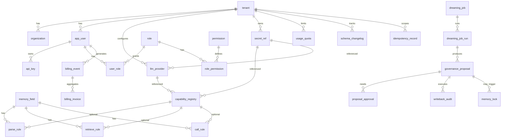

# Memory Engine MySQL 数据库表设计（v0.5 优化版）

> 版本：v0.5 | 状态：v0.4 的修订与扩展  
> 字符集：`utf8mb4` / `utf8mb4_unicode_ci`  
> 库名：`memory_engine`  
> 表数：**26 张**（v0.4 的 23 张 + 新增 `idempotency_record` / `llm_provider` / `secret_ref`）

---

## 0. v0.5 相对 v0.4 的变更摘要

| 类别 | 变更 |
|------|------|
| **修复 bug** | `capability_registry.deleted` 字段去重；`tenant` / `memory_field` 的 `created_at/updated_at` 统一为 `create_time/update_time`；`tenant` 补 `deleted` 字段；ER 图补 `schema_changelog` |
| **补全字段** | RBAC 4 表 / 计费 3 表 / Dreaming 6 表 / 审计 1 表的完整字段清单 |
| **语义澄清** | 版本耗尽语义、`capability_registry.config_json` vs `rule.rule_config_json` 边界、`api_key.org_id` 的 scope 含义、`user_role` 的 org 维度 |
| **新增字段** | 全表 `updated_by`；rule 表 `created_by`；memory_field/rule `source`；`capability_registry.enabled`；`dreaming_job.owner_user_id`；`governance_proposal.evidence_json` |
| **新增表** | `idempotency_record`（写 API 幂等）、`llm_provider`（LLM 接入点元数据）、`secret_ref`（密钥引用元数据，本体在外部 vault） |
| **索引增强** | `memory_field` 覆盖索引含 `deleted`；`proposal_uuid / event_id` 显式 UNIQUE；Canal 专用索引清单化 |
| **约束加固** | 全表 `CHECK (org_id >= 0)`；`CHECK (deleted IN (0,1))`；版本号 `> 0`；时间字段相对关系 CHECK |
| **主键统一** ⭐ | **26/26 表统一带自增 `id BIGINT UNSIGNED PK, AI`**；废弃 `role_permission` 的 `(role_id, permission_id)` 复合主键，改为自增 id + 含 `deleted` 的业务唯一索引（支持软删后重新授权） |

---

## 1. 设计约定（v0.5 修订）

### 1.1 命名规范（强制）

| 项 | 规则 |
|------|------|
| 时间字段 | 一律 `create_time` / `update_time`（v0.4 文档中 `created_at/updated_at` 全部修正） |
| 软删 | 一律 `deleted TINYINT(1)`；状态字段用 `status ENUM` 表达业务态 |
| 主键 | **所有表统一** `id BIGINT UNSIGNED NOT NULL AUTO_INCREMENT PRIMARY KEY`；关联表也走自增 id + 业务唯一索引，**不再使用复合主键** |
| 外键命名 | 引用表名_id（如 `tenant_id`、`memory_field_id`） |
| UUID 字段 | `*_uuid CHAR(36)`，必须建 UNIQUE |
| JSON 字段 | 后缀 `_json`，必须可空（避免 `''` 与 `NULL` 混淆） |
| 审计字段 | `created_by` / `updated_by` 均为 `app_user.id`，可空（系统操作时为 NULL） |

### 1.2 全局标准字段（26/26 表）

```sql
deleted     TINYINT(1)   NOT NULL DEFAULT 0  COMMENT '软删除: 0=有效 1=已删除',
create_time DATETIME(3)  NOT NULL DEFAULT CURRENT_TIMESTAMP(3) COMMENT '创建时间(UTC)',
update_time DATETIME(3)  NOT NULL DEFAULT CURRENT_TIMESTAMP(3)
                           ON UPDATE CURRENT_TIMESTAMP(3) COMMENT '更新时间(UTC)',
created_by  BIGINT UNSIGNED NULL COMMENT '创建人 app_user.id；系统操作为 NULL',
updated_by  BIGINT UNSIGNED NULL COMMENT '最后修改人 app_user.id；系统操作为 NULL',
```

**适用例外**：纯字典/关联表（`permission` / `role_permission`）允许省略 `updated_by`。

### 1.3 多租户与 org_id 哨兵

- 所有业务表含 `tenant_id`；`tenant_id` 建 FK 到 `tenant.id`
- 所有业务表含 `org_id BIGINT UNSIGNED NOT NULL DEFAULT 0`
- `org_id = 0` 表示"租户级、无组织"（哨兵值），**不建 FK**
- 全表加 `CHECK (org_id >= 0)`
- 应用层从 `organization` 取数据时必须显式过滤 `org_id > 0`

### 1.4 版本链规则（v0.5 澄清）

| 实体 | 版本链 | 重建语义 |
|------|--------|----------|
| `memory_field` | 独立 | 同名全部 `deleted=1` 后再创建，version 从 `MAX(version)+1` 接续（保留完整历史，避免唯一键冲突） |
| `parse_rule` | 独立，不与 memory_field 联动 | 同上 |
| `retrieve_rule` | 独立 | 同上 |
| `call_rule` | 独立 | 同上 |
| `capability_registry` | 独立 | 同上 |

**保留前向引用**：`parse_rule.memory_field_id` 绑定的是创建时的 `memory_field` 行 ID（即特定 version 的物理行 ID）。`memory_field` 升 version 时，旧 rule 仍指向旧行；应用层在执行 rule 时按 `memory_field.name` 查当前有效版本而不是用旧 ID。这样既保留历史又支持"自动接续"。

### 1.5 幂等性（新增）

所有 `POST /*/create | /*/update | /*/delete` 类 API 必须接收 `X-Idempotency-Key` 头：
- 若头存在，写入前查 `idempotency_record`，命中则返回旧结果
- 未命中则执行并落表 `(tenant_id, scope, key)`
- 默认保留期 7 天（CDC/审计场景可调）

### 1.6 LLM 密钥管理（v0.5 明确）

明文密钥不入 MySQL，存放在外部 vault（如 HashiCorp Vault、云 KMS）。MySQL 仅保留：

```
secret_ref(id, tenant_id, secret_name, vault_path, ...)
        ↑
        └── capability_registry.config_json.api_key_secret_ref（VARCHAR, 指向 secret_ref.id）
        └── llm_provider.api_key_secret_ref
```

---

## 2. ER 关系（补全）



---

## 3. 表清单（26 张）

| # | 表名 | 类别 | 说明 |
|---|------|------|------|
| 1 | `tenant` | 核心 | 租户 |
| 2 | `organization` | 核心 | 组织（`org_id ≥ 1`） |
| 3 | `app_user` | 核心 | 业务用户（Supabase 映射） |
| 4 | `memory_field` | Schema | 记忆 Schema 主表 |
| 5 | `capability_registry` | Schema | 能力注册中心 |
| 6 | `parse_rule` | Schema | 解析规则 |
| 7 | `retrieve_rule` | Schema | 检索规则 |
| 8 | `call_rule` | Schema | 引用规则 |
| 9 | `permission` | RBAC | 权限点字典 |
| 10 | `role` | RBAC | 角色 |
| 11 | `role_permission` | RBAC | 角色-权限 |
| 12 | `user_role` | RBAC | 用户-角色 |
| 13 | `api_key` | 凭证 | API Key（per-user） |
| 14 | **`llm_provider`** ⭐ | 凭证 | LLM 接入点元数据 |
| 15 | **`secret_ref`** ⭐ | 凭证 | 密钥引用元数据（本体在 vault） |
| 16 | `billing_event` | 计费 | 计费事件（异步） |
| 17 | `usage_quota` | 计费 | 用量额度 |
| 18 | `billing_invoice` | 计费 | 费用账单 |
| 19 | `dreaming_job` | Dreaming | 任务定义 |
| 20 | `dreaming_job_run` | Dreaming | 任务运行实例 |
| 21 | `governance_proposal` | Dreaming | 治理提案 |
| 22 | `proposal_approval` | Dreaming | 提案审批 |
| 23 | `memory_lock` | Dreaming | 记忆锁 |
| 24 | `writeback_audit` | Dreaming | 回写审计 |
| 25 | `schema_changelog` | 审计 | Schema 变更审计 |
| 26 | **`idempotency_record`** ⭐ | 审计 | 写 API 幂等记录 |

⭐ 为 v0.5 新增。

---

## 4. 表结构明细

> - 为节省篇幅，凡未单独列出的，均含 §1.2 全局标准字段。
> - 主键简写约定：所有表的 `id` 字段类型恒为 `BIGINT UNSIGNED NOT NULL AUTO_INCREMENT PRIMARY KEY`。文中 `PK, AI` 与 `PK` 两种写法等价，均代表自增主键。

### 4.1 tenant

| 字段 | 类型 | 约束 | 说明 |
|------|------|------|------|
| id | BIGINT UNSIGNED | PK, AI | |
| tenant_code | VARCHAR(64) | UNIQUE, NOT NULL | 对外编码 |
| name | VARCHAR(255) | NOT NULL | |
| status | ENUM('active','suspended','archived') | NOT NULL, DEFAULT 'active' | |
| settings_json | JSON | NULL | 租户配置 |
| **deleted** | TINYINT(1) | NOT NULL, DEFAULT 0 | **v0.5 补齐** |
| **create_time / update_time** | DATETIME(3) | NOT NULL | **v0.5 修正命名** |

**变更**：v0.4 缺 `deleted`、用 `created_at/updated_at`，与全局约定冲突，v0.5 修正。`status='archived'` 替代原 `status='deleted'`，软删走 `deleted=1` 单一通道。

---

### 4.2 organization

| 字段 | 类型 | 约束 | 说明 |
|------|------|------|------|
| id | BIGINT UNSIGNED | PK, AI | 从 1 开始；业务中 0 表示无组织 |
| tenant_id | BIGINT UNSIGNED | FK→tenant, NOT NULL | |
| org_code | VARCHAR(64) | NOT NULL | 租户内唯一 |
| name | VARCHAR(255) | NOT NULL | |
| status | ENUM('active','suspended','archived') | NOT NULL | |

**唯一索引**：`UNIQUE (tenant_id, org_code, deleted)`（v0.5：deleted 加入唯一键避免软删后无法复用同名 org_code）

---

### 4.3 app_user

| 字段 | 类型 | 约束 | 说明 |
|------|------|------|------|
| id | BIGINT UNSIGNED | PK, AI | |
| tenant_id | BIGINT UNSIGNED | FK→tenant | |
| org_id | BIGINT UNSIGNED | NOT NULL, DEFAULT 0 | 0=租户级用户（跨组织） |
| supabase_user_id | VARCHAR(128) | NULL | Supabase UUID（Auth 解耦） |
| email | VARCHAR(320) | NOT NULL | |
| display_name | VARCHAR(255) | NULL | |
| status | ENUM('active','disabled') | NOT NULL | |
| metadata_json | JSON | NULL | |

**索引**：`UNIQUE (tenant_id, email, deleted)`、`INDEX (supabase_user_id)`、`INDEX (tenant_id, org_id)`

---

### 4.4 memory_field

| 字段 | 类型 | 约束 | 说明 |
|------|------|------|------|
| id | BIGINT UNSIGNED | PK, AI | 物理行 ID（rule 表绑定的就是这个） |
| tenant_id | BIGINT UNSIGNED | NOT NULL | |
| org_id | BIGINT UNSIGNED | NOT NULL, DEFAULT 0 | |
| name | VARCHAR(255) | NOT NULL | 记忆名称（业务标识） |
| description | VARCHAR(1024) | NULL | |
| value_type | ENUM('string','number','boolean','json','array','text') | NOT NULL | |
| match_method | ENUM('OVERWRITE','APPEND','MERGE') | NOT NULL | 数据写入默认策略；调用 `Data.parse(...WRITERULE)` 可覆盖 |
| storage_type | ENUM('KV','VECTOR','KV_AND_VECTOR') | NOT NULL | |
| version | INT UNSIGNED | NOT NULL, DEFAULT 1, CHECK > 0 | |
| status | ENUM('active','deprecated') | NOT NULL, DEFAULT 'active' | **v0.5 新增**；deprecated 时只读不再 parse |
| **source** | ENUM('dashboard','sdk','dreaming','api') | NOT NULL, DEFAULT 'api' | **v0.5 新增**：来源追踪 |

**索引**：
- `UNIQUE (tenant_id, org_id, name, version)`
- `INDEX idx_mf_lookup (tenant_id, org_id, name, deleted, version DESC)` ⭐ **v0.5 新增**：典型 `Schema.get` 查询的覆盖索引
- `INDEX idx_mf_canal (update_time)` ⭐ **v0.5 显式**

**典型查询**：
```sql
SELECT * FROM memory_field
WHERE tenant_id = ? AND org_id = ? AND name = ? AND deleted = 0
ORDER BY version DESC LIMIT 1;
-- 走 idx_mf_lookup，回表一次
```

---

### 4.5 capability_registry

| 字段 | 类型 | 约束 | 说明 |
|------|------|------|------|
| id | BIGINT UNSIGNED | PK, AI | |
| tenant_id | BIGINT UNSIGNED | NOT NULL | |
| org_id | BIGINT UNSIGNED | NOT NULL, DEFAULT 0 | |
| capability_name | VARCHAR(128) | NOT NULL | |
| module_name | VARCHAR(255) | NOT NULL | Python 模块路径 |
| service_name | VARCHAR(128) | NOT NULL | 函数/服务名 |
| rule_kind | ENUM('parse','retrieve','call') | NOT NULL | |
| slot_name | VARCHAR(128) | NULL | call 时槽位 |
| config_json | JSON | NULL | **能力级配置**（不含业务参数）：`base_url`、`model`、`api_key_secret_ref`（指向 `secret_ref.id`）、`default_prompt_template` |
| **llm_provider_id** | BIGINT UNSIGNED | NULL | **v0.5 新增** FK→llm_provider |
| **enabled** | TINYINT(1) | NOT NULL, DEFAULT 1 | **v0.5 新增**：临时禁用但不删除 |
| last_seen_time | DATETIME(3) | NULL | SDK 心跳上报 |
| heartbeat_version | BIGINT UNSIGNED | DEFAULT 0 | |
| code_fingerprint | VARCHAR(64) | NULL | 离线扫描指纹 |
| version | INT UNSIGNED | NOT NULL, CHECK > 0 | 独立版本链 |
| owner_user_id | BIGINT UNSIGNED | NULL | **v0.5 新增**：SDK 注册者 |

**唯一索引**：`UNIQUE (tenant_id, org_id, capability_name, rule_kind, version)`

**与 rule 表的边界**（v0.5 明确）：
- `capability_registry.config_json`：**能力级**——LLM endpoint、模型名、密钥引用、默认 prompt 模板
- `parse_rule.rule_config_json`：**业务级**——具体 prompt 内容、解析后的字段映射、阈值、采样规则

---

### 4.6 parse_rule

| 字段 | 类型 | 约束 | 说明 |
|------|------|------|------|
| id | BIGINT UNSIGNED | PK, AI | |
| tenant_id / org_id | BIGINT UNSIGNED | NOT NULL | |
| memory_field_id | BIGINT UNSIGNED | NOT NULL, FK→memory_field.id | 绑定特定 version 的物理行 |
| memory_field_name | VARCHAR(255) | NOT NULL | 冗余，便于查询/审计 |
| rule_name | VARCHAR(128) | NOT NULL | |
| capability_id | BIGINT UNSIGNED | NULL, FK→capability_registry.id | |
| rule_type | ENUM('builtin','custom') | NOT NULL, DEFAULT 'custom' | **v0.5 新增** |
| rule_config_json | JSON | NULL | 业务级配置 |
| priority | INT | NOT NULL, DEFAULT 0 | 多规则按 priority DESC 串行执行 |
| version | INT UNSIGNED | NOT NULL, CHECK > 0 | 独立版本链 |
| source | ENUM('dashboard','sdk','dreaming','api') | NOT NULL | **v0.5 新增** |

**索引**：
- `UNIQUE (tenant_id, org_id, memory_field_id, rule_name, version)`
- `INDEX (tenant_id, org_id, memory_field_name, deleted, version DESC)`
- `INDEX (capability_id, deleted)`

---

### 4.7 retrieve_rule

继承 `parse_rule` 的所有字段（含独立的自增主键 `id BIGINT UNSIGNED PK, AI`），差异如下：

| 字段 | 类型 | 说明 |
|------|------|------|
| id | BIGINT UNSIGNED | PK, AI（独立自增序列，不与 parse_rule 共享） |
| retrieve_method | ENUM('EXACT','REGEX','SEMANTIC','LLM') | NOT NULL |
| memory_field_id | BIGINT UNSIGNED | **NULL**（隐式检索允许） |
| memory_field_name | VARCHAR(255) | **NULL**（隐式检索允许） |

**成对约束**（**仅应用层**）：`(memory_field_id IS NULL AND memory_field_name IS NULL) OR (两者均非 NULL)`。因 `memory_field_id` 参与 `FK ON DELETE SET NULL`，MySQL 3823 禁止同列再建 CHECK。

**业务约定**（应用层保证）：一个 memory_field 同时只允许一条 `deleted=0` 的 retrieve_rule（多条会语义歧义）；隐式 retrieve_rule 在租户/组织维度也只允许一条。

---

### 4.8 call_rule

字段继承 `parse_rule`（含独立的自增主键 `id BIGINT UNSIGNED PK, AI`），差异：

| 字段 | 类型 | 说明 |
|------|------|------|
| id | BIGINT UNSIGNED | PK, AI（独立自增序列，不与 parse_rule / retrieve_rule 共享） |
| slot_name | VARCHAR(128) | NOT NULL，prompt 槽位标识 |
| memory_field_id | BIGINT UNSIGNED | NOT NULL（call 必须绑定具体 memory_field） |

**唯一索引**：`UNIQUE (tenant_id, org_id, memory_field_id, slot_name, version)`（同一 slot 同 version 唯一）

---

### 4.9 permission

| 字段 | 类型 | 说明 |
|------|------|------|
| id | BIGINT UNSIGNED PK | |
| permission_code | VARCHAR(64) | UNIQUE NOT NULL，如 `schema:write` |
| permission_name | VARCHAR(128) | NOT NULL，显示名 |
| category | ENUM('schema','data','runtime','debug','billing','governance','dashboard') | NOT NULL |
| description | VARCHAR(512) | NULL |

**预置权限码**（v0.5 完整清单）：

| 类别 | 权限码 |
|------|--------|
| schema | `schema:read`, `schema:write` |
| data | `data:read`, `data:write` |
| runtime | `parse:execute`, `retrieve:execute`, `call:execute` |
| debug | `debug:list` |
| billing | `billing:read`, `billing:manage` |
| governance | `governance:approve`, `governance:apply`, `governance:lock` |
| dashboard | `dashboard:user_manage`, `dashboard:tenant_manage` |

> 说明：`permission` 是全局字典，不含 `tenant_id`；新增权限点通过 migration。

---

### 4.10 role

| 字段 | 类型 | 说明 |
|------|------|------|
| id | BIGINT UNSIGNED PK | |
| tenant_id | BIGINT UNSIGNED | NOT NULL，FK→tenant（系统内置角色 tenant_id=0） |
| role_code | VARCHAR(64) | NOT NULL，租户内唯一 |
| role_name | VARCHAR(128) | NOT NULL |
| role_type | ENUM('system','custom') | NOT NULL，DEFAULT 'custom' |
| description | VARCHAR(512) | NULL |

**唯一索引**：`UNIQUE (tenant_id, role_code, deleted)`

**预置系统角色**（tenant_id=0）：`tenant_admin`、`org_admin`、`developer`、`viewer`、`billing_admin`、`governance_reviewer`

---

### 4.11 role_permission

| 字段 | 类型 | 说明 |
|------|------|------|
| **id** | BIGINT UNSIGNED | PK, AI | **v0.5 修订**：废弃复合主键，统一自增 id |
| role_id | BIGINT UNSIGNED | NOT NULL, FK→role |
| permission_id | BIGINT UNSIGNED | NOT NULL, FK→permission |
| deleted / create_time / update_time / created_by | | 标准字段 |

**唯一索引**：`UNIQUE uk_role_permission (role_id, permission_id, deleted)`

**变更说明**：v0.4 / v0.5 草案使用 `(role_id, permission_id)` 复合主键，与全局"每张表自增 id"约定冲突，且软删时无法复用同一 (role_id, permission_id) 组合。v0.5 正式版改为自增 id + 包含 `deleted` 的业务唯一索引，软删后允许重新授权。

---

### 4.12 user_role（v0.5 修订：增加 org 维度）

| 字段 | 类型 | 说明 |
|------|------|------|
| id | BIGINT UNSIGNED PK | |
| tenant_id | BIGINT UNSIGNED | NOT NULL |
| **org_id** | BIGINT UNSIGNED | NOT NULL, DEFAULT 0 | **v0.5 新增**：用户在特定组织中担任的角色；0 表示租户级角色 |
| user_id | BIGINT UNSIGNED | NOT NULL, FK→app_user |
| role_id | BIGINT UNSIGNED | NOT NULL, FK→role |
| expires_at | DATETIME(3) | NULL，到期自动失效 |

**唯一索引**：`UNIQUE (user_id, org_id, role_id, deleted)`

**变更说明**：v0.4 没有 org_id，意味着用户只能持有"全租户角色"。v0.5 允许"用户 A 在组织 X 是 admin、在组织 Y 是 viewer"。

---

### 4.13 api_key

| 字段 | 类型 | 说明 |
|------|------|------|
| id | BIGINT UNSIGNED PK | |
| tenant_id | BIGINT UNSIGNED | NOT NULL |
| org_id | BIGINT UNSIGNED | NOT NULL, DEFAULT 0 | 0 = 跨组织（租户内全权） |
| user_id | BIGINT UNSIGNED | NOT NULL, FK→app_user |
| key_prefix | VARCHAR(16) | NOT NULL, UNIQUE, 如 `mos_xxxx` |
| key_hash | VARCHAR(128) | NOT NULL, bcrypt/argon2 |
| **scope_org_ids_json** | JSON | NULL | **v0.5 新增**：多组织 scope（NULL 表示按 `org_id` 字段单组织/租户） |
| permissions_json | JSON | NULL | 覆盖角色权限的细粒度 scope |
| expires_at | DATETIME(3) | NULL |
| revoked_at | DATETIME(3) | NULL |
| last_used_at | DATETIME(3) | NULL |

**索引**：
- `UNIQUE (key_prefix)` ⭐ APISIX 鉴权热路径
- `INDEX (tenant_id, user_id, deleted)`

**APISIX 校验语义澄清**：
1. 取 `key_prefix` 查 `api_key`（命中 unique 索引）
2. 校验 `deleted=0 AND revoked_at IS NULL AND (expires_at IS NULL OR expires_at > NOW(3))`
3. 哈希比对客户端传入的完整 key
4. 注入 `tenant_id / user_id / scope_org_ids / permissions` 到下游 fastapi context

---

### 4.14 llm_provider（v0.5 新增）

LLM 接入点元数据。v0.4 把这些塞在 `capability_registry.config_json` 里，无法跨能力复用且密钥分散。

| 字段 | 类型 | 说明 |
|------|------|------|
| id | BIGINT UNSIGNED PK | |
| tenant_id / org_id | | 标准 |
| provider_code | VARCHAR(64) | NOT NULL，如 `openai_prod`, `volcengine_doubao` |
| provider_type | ENUM('openai','anthropic','volcengine','azure','custom') | NOT NULL |
| base_url | VARCHAR(512) | NOT NULL |
| default_model | VARCHAR(128) | NOT NULL |
| api_key_secret_ref | BIGINT UNSIGNED | NULL, FK→secret_ref |
| extra_config_json | JSON | NULL，请求头、超时、限流等 |
| status | ENUM('active','disabled') | NOT NULL |

**唯一索引**：`UNIQUE (tenant_id, org_id, provider_code, deleted)`

---

### 4.15 secret_ref（v0.5 新增）

密钥引用元数据。**本体在外部 vault**（Supabase Vault / KMS），MySQL 仅保留元数据用于审计、权限、轮转追踪。

| 字段 | 类型 | 说明 |
|------|------|------|
| id | BIGINT UNSIGNED PK | |
| tenant_id / org_id | | 标准 |
| secret_name | VARCHAR(128) | NOT NULL，业务别名 |
| vault_path | VARCHAR(512) | NOT NULL，vault 内路径 |
| secret_type | ENUM('llm_api_key','db_password','webhook_token','other') | NOT NULL |
| last_rotated_at | DATETIME(3) | NULL |
| rotation_interval_days | INT | NULL，提醒轮转 |

**唯一索引**：`UNIQUE (tenant_id, org_id, secret_name, deleted)`

---

### 4.16 billing_event（v0.5 完整字段）

异步计费事件。LLM 调用、parse/retrieve 后 fire-and-forget。

| 字段 | 类型 | 说明 |
|------|------|------|
| id | BIGINT UNSIGNED PK | |
| event_uuid | CHAR(36) | NOT NULL，UNIQUE，业务幂等 ID |
| tenant_id | BIGINT UNSIGNED | NOT NULL |
| org_id | BIGINT UNSIGNED | NOT NULL, DEFAULT 0 |
| user_id | BIGINT UNSIGNED | NOT NULL, FK→app_user |
| api_key_id | BIGINT UNSIGNED | NULL, FK→api_key |
| event_type | ENUM('llm_completion','embedding','retrieve','parse','call') | NOT NULL |
| llm_provider_id | BIGINT UNSIGNED | NULL, FK→llm_provider |
| model_name | VARCHAR(128) | NULL |
| prompt_tokens | INT UNSIGNED | NOT NULL, DEFAULT 0 |
| completion_tokens | INT UNSIGNED | NOT NULL, DEFAULT 0 |
| total_tokens | INT UNSIGNED | NOT NULL, DEFAULT 0 |
| cost_amount | DECIMAL(12, 6) | NOT NULL, DEFAULT 0 |
| currency | CHAR(3) | NOT NULL, DEFAULT 'CNY' |
| status | ENUM('pending','processed','failed') | NOT NULL, DEFAULT 'pending' |
| processed_at | DATETIME(3) | NULL |
| failure_reason | VARCHAR(512) | NULL |
| trace_id | VARCHAR(64) | NULL |
| occurred_at | DATETIME(3) | NOT NULL，事件实际发生时间（vs create_time 入表时间） |

**索引**：
- `UNIQUE (event_uuid)`
- `INDEX idx_billing_pending (status, deleted, create_time)` ⭐ pending 消费者
- `INDEX (tenant_id, org_id, user_id, occurred_at)` 用户账单聚合
- `INDEX (trace_id)`

---

### 4.17 usage_quota（v0.5 完整字段）

| 字段 | 类型 | 说明 |
|------|------|------|
| id | BIGINT UNSIGNED PK | |
| tenant_id / org_id | | 标准 |
| scope | ENUM('tenant','org','user') | NOT NULL，额度作用层级 |
| target_id | BIGINT UNSIGNED | NOT NULL，对应 tenant.id / org.id / user.id |
| quota_type | ENUM('tokens','cost','requests') | NOT NULL |
| period | ENUM('daily','monthly','total') | NOT NULL |
| period_tz | VARCHAR(64) | NOT NULL, DEFAULT 'Asia/Shanghai'，**v0.5 新增**：周期统计时区 |
| quota_limit | DECIMAL(20, 6) | NOT NULL |
| quota_used | DECIMAL(20, 6) | NOT NULL, DEFAULT 0 |
| period_start | DATETIME(3) | NOT NULL |
| period_end | DATETIME(3) | NOT NULL |
| status | ENUM('active','exceeded','disabled') | NOT NULL |

**索引**：`UNIQUE (tenant_id, scope, target_id, quota_type, period, period_start, deleted)`

**CHECK**：`quota_limit >= 0`、`quota_used >= 0`、`period_end > period_start`

---

### 4.18 billing_invoice

| 字段 | 类型 | 说明 |
|------|------|------|
| id | BIGINT UNSIGNED PK | |
| invoice_uuid | CHAR(36) UNIQUE NOT NULL | |
| tenant_id | BIGINT UNSIGNED | NOT NULL |
| org_id | BIGINT UNSIGNED | NOT NULL, DEFAULT 0 |
| period_month | CHAR(7) | NOT NULL，格式 `YYYY-MM` |
| **period_tz** | VARCHAR(64) | NOT NULL，**v0.5 新增**：账单周期归属时区，与 usage_quota 一致 |
| total_tokens | BIGINT UNSIGNED | NOT NULL |
| total_amount | DECIMAL(20, 6) | NOT NULL |
| currency | CHAR(3) | NOT NULL |
| status | ENUM('draft','issued','paid','overdue','void') | NOT NULL |
| details_json | JSON | NULL，明细分组（按 event_type / model） |
| issued_at | DATETIME(3) | NULL |
| paid_at | DATETIME(3) | NULL |

**索引**：`UNIQUE (tenant_id, org_id, period_month, deleted)`

---

### 4.19 dreaming_job

| 字段 | 类型 | 说明 |
|------|------|------|
| id | BIGINT UNSIGNED PK | |
| tenant_id / org_id | | 标准 |
| job_name | VARCHAR(255) | NOT NULL |
| tier | ENUM('LIGHT','REM','DEEP') | NOT NULL |
| source | ENUM('system','user') | NOT NULL |
| **owner_user_id** | BIGINT UNSIGNED | NULL，FK→app_user | **v0.5 新增**：source=user 时必填 |
| engine | ENUM('spark','flink') | NOT NULL |
| task_template_code | VARCHAR(64) | NULL，系统任务库模板代码 |
| config_json | JSON | NULL，阈值、窗口、审批策略 |
| cron_expr | VARCHAR(64) | NULL，定时表达式；NULL=仅事件/手动触发 |
| status | ENUM('enabled','paused','disabled') | NOT NULL |

**owner 约束**（**仅应用层**）：`source='user'` 时 `owner_user_id` 必填。因 `owner_user_id` 有 `FK ON DELETE SET NULL`，不可建 CHECK（MySQL 3823）。

---

### 4.20 dreaming_job_run

| 字段 | 类型 | 说明 |
|------|------|------|
| id | BIGINT UNSIGNED PK | |
| run_uuid | CHAR(36) UNIQUE NOT NULL | |
| job_id | BIGINT UNSIGNED | NOT NULL, FK→dreaming_job |
| tenant_id / org_id | | 冗余，便于权限/分区查询 |
| temporal_workflow_id | VARCHAR(255) | NOT NULL |
| temporal_run_id | VARCHAR(255) | NOT NULL |
| trigger_type | ENUM('schedule','event','manual') | NOT NULL |
| triggered_by_user_id | BIGINT UNSIGNED | NULL，manual 触发时记录 |
| status | ENUM('queued','running','succeeded','failed','cancelled','timed_out') | NOT NULL |
| started_at | DATETIME(3) | NULL |
| finished_at | DATETIME(3) | NULL |
| stats_json | JSON | NULL，扫描行数、产出提案数、耗时等 |
| failure_reason | VARCHAR(1024) | NULL |

**索引**：
- `UNIQUE (run_uuid)`
- `INDEX (job_id, status, started_at)`
- `UNIQUE (temporal_workflow_id, temporal_run_id)`

---

### 4.21 governance_proposal

| 字段 | 类型 | 说明 |
|------|------|------|
| id | BIGINT UNSIGNED PK | |
| proposal_uuid | CHAR(36) UNIQUE NOT NULL | |
| tenant_id / org_id | | 标准 |
| job_run_id | BIGINT UNSIGNED | NULL, FK→dreaming_job_run；NULL=人工创建 |
| target_type | ENUM('memory_field','memory_data','parse_rule','retrieve_rule','call_rule') | NOT NULL |
| target_ref_json | JSON | NOT NULL，目标定位（如 `{"memory_field_name":"用户年龄","user_id":"u_xxx"}`），**不**用具体行 id 以解耦版本 |
| action | ENUM('create','update','delete','merge','freeze','unfreeze') | NOT NULL |
| payload_json | JSON | NOT NULL，待应用的内容 |
| **evidence_json** | JSON | NULL，**v0.5 新增**：证据链（样本、指标、对比） |
| confidence_score | DECIMAL(5, 4) | NOT NULL, CHECK BETWEEN 0 AND 1 |
| impact_scope_json | JSON | NULL，影响范围分析（命中率、引用次数等） |
| risk_level | ENUM('low','medium','high') | NOT NULL |
| status | ENUM('draft','pending_review','approved','rejected','applied','rolled_back','expired') | NOT NULL, DEFAULT 'draft' |
| auto_apply | TINYINT(1) | NOT NULL, DEFAULT 0 |
| applied_at | DATETIME(3) | NULL |
| rolled_back_at | DATETIME(3) | NULL |
| expires_at | DATETIME(3) | NULL，超时未审批自动 expired |

**索引**：
- `UNIQUE (proposal_uuid)`
- `INDEX (tenant_id, org_id, status, risk_level, create_time)`
- `INDEX (job_run_id)`

**CHECK**：`(auto_apply = 1 AND risk_level = 'low') OR (auto_apply = 0)`（高风险禁止自动）

---

### 4.22 proposal_approval（v0.5 支持多级审批）

| 字段 | 类型 | 说明 |
|------|------|------|
| id | BIGINT UNSIGNED PK | |
| proposal_id | BIGINT UNSIGNED | NOT NULL, FK→governance_proposal |
| **approval_level** | INT | NOT NULL, DEFAULT 1 | **v0.5 新增**：多级审批层级 |
| approver_user_id | BIGINT UNSIGNED | NOT NULL, FK→app_user |
| decision | ENUM('approve','reject','request_changes') | NOT NULL |
| comment | VARCHAR(1024) | NULL |
| decided_at | DATETIME(3) | NOT NULL |

**索引**：`UNIQUE (proposal_id, approval_level, approver_user_id, deleted)`

---

### 4.23 memory_lock（v0.5 完整字段）

| 字段 | 类型 | 说明 |
|------|------|------|
| id | BIGINT UNSIGNED PK | |
| tenant_id / org_id | | 标准 |
| lock_type | ENUM('schema_readonly','schema_freeze','data_readonly','data_freeze') | NOT NULL |
| target_type | ENUM('memory_field','memory_data') | NOT NULL |
| target_ref_json | JSON | NOT NULL，定位目标（memory_field_name / user_id 等） |
| locked_by_user_id | BIGINT UNSIGNED | NOT NULL |
| reason | VARCHAR(512) | NULL |
| triggered_by_proposal_id | BIGINT UNSIGNED | NULL，FK→governance_proposal |
| expires_at | DATETIME(3) | NULL，自动解锁；NULL=永久 |
| released_at | DATETIME(3) | NULL，手动解锁时间 |

**索引**：`INDEX (tenant_id, org_id, target_type, deleted)`

---

### 4.24 writeback_audit（v0.5 完整字段）

| 字段 | 类型 | 说明 |
|------|------|------|
| id | BIGINT UNSIGNED PK | |
| proposal_id | BIGINT UNSIGNED | NOT NULL, FK→governance_proposal |
| tenant_id / org_id | | 冗余 |
| api_endpoint | VARCHAR(255) | NOT NULL，如 `POST /schema/update` |
| target_type | ENUM('memory_field','memory_data','parse_rule','retrieve_rule','call_rule') | NOT NULL |
| target_id_before | BIGINT UNSIGNED | NULL，变更前 id |
| target_id_after | BIGINT UNSIGNED | NULL，变更后 id（如 update 产生新 version 行） |
| version_before | INT UNSIGNED | NULL |
| version_after | INT UNSIGNED | NULL |
| request_payload_json | JSON | NULL |
| response_payload_json | JSON | NULL |
| status | ENUM('succeeded','failed','rolled_back') | NOT NULL |
| rollback_deadline | DATETIME(3) | NULL，撤回窗口截止 |
| rolled_back_at | DATETIME(3) | NULL |
| rollback_reason | VARCHAR(512) | NULL |

**索引**：`INDEX (proposal_id)`、`INDEX (tenant_id, org_id, status, create_time)`

---

### 4.25 schema_changelog（v0.5 明确语义）

应用层或 CDC 消费者写入。**对象是业务级 schema 变更**（memory_field、rule 的增删改），不是 DDL 表结构变更。

| 字段 | 类型 | 说明 |
|------|------|------|
| id | BIGINT UNSIGNED PK | |
| tenant_id / org_id | | 标准 |
| change_uuid | CHAR(36) UNIQUE NOT NULL | |
| target_type | ENUM('memory_field','parse_rule','retrieve_rule','call_rule','capability_registry') | NOT NULL |
| target_id | BIGINT UNSIGNED | NOT NULL |
| target_name | VARCHAR(255) | NULL，便于检索 |
| change_action | ENUM('create','update','delete','version_bump') | NOT NULL |
| version_before | INT UNSIGNED | NULL |
| version_after | INT UNSIGNED | NULL |
| diff_json | JSON | NULL，字段级 diff |
| source | ENUM('api','dashboard','sdk','dreaming','migration') | NOT NULL |
| operator_user_id | BIGINT UNSIGNED | NULL |
| trace_id | VARCHAR(64) | NULL |

**索引**：
- `UNIQUE (change_uuid)`
- `INDEX (tenant_id, org_id, target_type, target_id, create_time)`

---

### 4.26 idempotency_record（v0.5 新增）

| 字段 | 类型 | 说明 |
|------|------|------|
| id | BIGINT UNSIGNED PK | |
| tenant_id | BIGINT UNSIGNED | NOT NULL |
| idempotency_key | VARCHAR(128) | NOT NULL，客户端 `X-Idempotency-Key` 头 |
| scope | VARCHAR(64) | NOT NULL，API 路径作 scope，如 `schema:create` |
| request_hash | CHAR(64) | NOT NULL，SHA-256(req body)，防同 key 不同体 |
| response_status | INT | NOT NULL |
| response_body_json | JSON | NULL |
| expires_at | DATETIME(3) | NOT NULL，默认 +7d |

**索引**：`UNIQUE (tenant_id, scope, idempotency_key)`、`INDEX (expires_at)` 用于清理

**写入语义**：
1. 收到请求 → 命中 `(tenant_id, scope, key)` → 检查 `request_hash`：一致返回旧响应；不一致返回 `409 Conflict`
2. 未命中 → 执行业务 → 落 `idempotency_record`（与业务表在同一事务中或紧随其后）

---

## 5. 关键变更详解

### 5.1 命名一致性（向后兼容方案）

v0.4 中 `tenant.created_at` 与 `memory_field.created_at` 已硬编码。迁移建议：

```sql
-- 一次性 DDL（如有线上数据）
ALTER TABLE tenant CHANGE created_at create_time DATETIME(3) NOT NULL;
ALTER TABLE tenant CHANGE updated_at update_time DATETIME(3) NOT NULL;
ALTER TABLE tenant ADD COLUMN deleted TINYINT(1) NOT NULL DEFAULT 0;
-- 类似处理 memory_field
```

应用层 ORM 同步更新。

### 5.2 version 重建的语义保证

```sql
-- INSERT 新版本时，version 从历史 MAX 接续，无论是否 deleted
INSERT INTO memory_field (tenant_id, org_id, name, ..., version)
SELECT ?, ?, ?, ..., COALESCE(MAX(version), 0) + 1
FROM memory_field
WHERE tenant_id = ? AND org_id = ? AND name = ?;
```

这保证 `UNIQUE (tenant_id, org_id, name, version)` 不会因为软删后重建而冲突。

### 5.3 rule 与 memory_field 的版本解耦

应用层契约：
- 创建 rule 时，记录当前 `memory_field.id`（特定 version 物理行 ID）
- **执行 rule 时**，不直接用旧 ID，而是 `JOIN memory_field ON memory_field.name = rule.memory_field_name AND deleted = 0 ORDER BY version DESC LIMIT 1`
- 这样 memory_field 升 version 时 rule 自动跟随（除非业务上希望"老 rule 固定老版本"，此时切到按 ID JOIN）

### 5.4 治理提案与 target 的解耦

`governance_proposal.target_ref_json` 而非 `target_id`：
- 提案产出后，memory_field 可能已升 version
- 应用提案时按 `target_ref_json` 中的逻辑标识（如 `name`）解析当前有效行
- 避免提案因目标行 version 变动而失效

---

## 6. 外键与索引（v0.5 摘要）

### 6.1 数量统计

| 类别 | v0.4 | v0.5 | 增量 |
|------|------|------|------|
| 外键 | 43 | **51** | +8（llm_provider、secret_ref、新表关联） |
| 唯一索引 | 18 | **26** | +8（含 uuid 字段、新表唯一约束） |
| 普通索引 | 52+ | **65+** | 覆盖索引、Canal 索引、新表索引 |
| Canal 索引 | 12 | **14** | 新增 llm_provider、capability_registry 显式 canal 索引 |
| CHECK | 30+ | **45+** | 全表 `org_id >= 0`、`deleted IN (0,1)`、版本号、时间相对关系等 |

### 6.2 v0.5 新增/优化的关键索引

```sql
-- memory_field 当前有效版本覆盖索引（核心热路径）
CREATE INDEX idx_mf_lookup
  ON memory_field (tenant_id, org_id, name, deleted, version DESC);

-- api_key APISIX 鉴权（唯一前缀已隐含索引）
-- 已在 4.13 定义

-- billing_event 消费者
CREATE INDEX idx_billing_pending
  ON billing_event (status, deleted, create_time)
  -- 注意：MySQL 不支持部分索引，应用层维度过滤即可
;

-- governance_proposal 审核台
CREATE INDEX idx_proposal_review
  ON governance_proposal (tenant_id, org_id, status, risk_level, create_time);

-- writeback_audit 回滚窗口扫描
CREATE INDEX idx_writeback_rollback
  ON writeback_audit (status, rollback_deadline);

-- idempotency_record 清理任务
CREATE INDEX idx_idem_expire ON idempotency_record (expires_at);
```

### 6.3 v0.5 关键 CHECK

```sql
-- 通用
CHECK (org_id >= 0)
CHECK (deleted IN (0, 1))
CHECK (version > 0)

-- governance
CHECK (confidence_score BETWEEN 0 AND 1)
CHECK ((auto_apply = 1 AND risk_level = 'low') OR auto_apply = 0)

-- usage_quota
CHECK (quota_limit >= 0 AND quota_used >= 0)
CHECK (period_end > period_start)

-- retrieve_rule（显式/隐式成对）：应用层校验，不可建 CHECK（memory_field_id 有 FK SET NULL）

-- dreaming_job（source=user 须 owner_user_id）：应用层校验，不可建 CHECK（owner_user_id 有 FK SET NULL）
```

---

## 7. Redis / MongoDB / Qdrant 协同（沿用 v0.4）

无变化。注意 `mos:schema:{tenant}:{org}:{name}` key 在 v0.5 命名上保持稳定。

---

## 8. API 调用日志（沿用 v0.4）

无变化。Kafka → 对象存储 → Trino。

---

## 9. 版本与更新语义（v0.5 补充）

### 9.1 memory_field.update

1. 当前 `deleted=0` 行 → `deleted=1`、`updated_by`、`update_time` 自动更新
2. INSERT 新行，`version = MAX(version) + 1`
3. **不修改** parse/retrieve/call_rule、capability_registry
4. 写 `schema_changelog`（`change_action='version_bump'`、记录 diff）
5. Canal 捕获 → Kafka → Redis 失效

### 9.2 memory_field.delete 后重建

1. 所有 version 行 `deleted=1`
2. Redis 设带 `deleted` 标记的 JSON（TTL 300s）
3. Canal → Kafka → Consumer DEL
4. 重建时 `version = old MAX(version) + 1`（不重置）

### 9.3 rule 表（同理三个）

1. 旧规则行 `deleted=1`
2. 新规则行 `version+1`
3. `memory_field_id` 仍指向创建时的物理行 ID
4. 执行时按 `memory_field_name` JOIN 当前有效 memory_field（v0.5 应用层契约）

### 9.4 治理提案应用

1. proposal `status='approved'` → 调用对应 Schema/Data API
2. 写 `writeback_audit`，记录 `target_id_before/after`、`version_before/after`
3. 设 `rollback_deadline = NOW() + interval`（按 risk_level 配置）
4. proposal `status='applied'`、`applied_at`

### 9.5 回滚

1. 在 `rollback_deadline` 前
2. 调用对应 API 反向操作（update 反向 update、create 反向 delete）
3. `writeback_audit.status='rolled_back'`、`rolled_back_at`
4. proposal `status='rolled_back'`、`rolled_back_at`

---

## 10. 完整 SQL 与配套文档

| 文件 | 说明 |
|------|------|
| `backend/migrations/mysql/002_v0.5_upgrade.sql` | v0.4 → v0.5 增量迁移 |
| `backend/migrations/mysql/001_initial_schema.sql` | 重生成的全量建库（v0.5 一次到位） |
| `docs/database/foreign-keys-and-indexes.md` | v0.5 外键/索引/CHECK 全量清单 |
| `docs/database/migration-v04-to-v05.md` | 迁移指南（命名、新表、字段补齐） |
