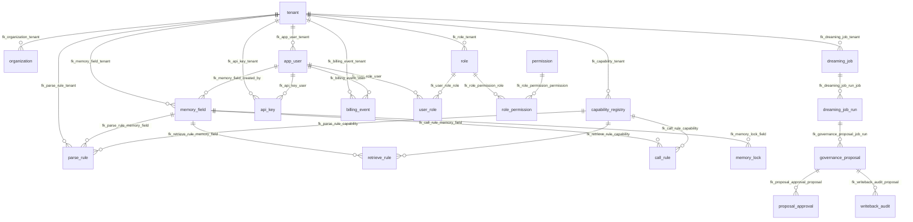

# Memory Engine 外键与索引设计说明（v0.4）

> 配合 `backend/migrations/mysql/001_initial_schema.sql` 使用

---

## 1. 外键设计原则

| 原则 | 说明 |
|------|------|
| 租户根 | 所有含 `tenant_id` 的业务表 **FK → tenant(id)**，`ON DELETE RESTRICT ON UPDATE CASCADE` |
| org_id 不建 FK | `org_id = 0` 为哨兵值，无法引用 `organization`；由应用层校验 `org_id > 0` 时组织存在 |
| 软删除 | 外键 **不级联软删**；删除父行用 `RESTRICT`，防止误物理删 |
| 可空外键 | `ON DELETE SET NULL`：如 `memory_field.created_by`、`capability_id` |
| 关联表 | `role_permission` / `user_role` 使用 `ON DELETE CASCADE`（物理删角色/用户时清理关联行） |
| 租户一致性 | `parse_rule.tenant_id` 须与 `memory_field.tenant_id` 一致，**由应用层保证**（MySQL 无跨表复合 FK） |

### 1.1 外键动作矩阵

| 动作 | 使用场景 |
|------|----------|
| `RESTRICT` | 核心实体（tenant、memory_field、proposal 等） |
| `CASCADE` | 纯关联表（role_permission、user_role、proposal_approval） |
| `SET NULL` | 可选引用（capability_id、job_run_id、created_by） |

---

## 2. 外键清单（共 42 条）

| # | 子表 | 约束名 | 列 | 父表 | 父列 | ON DELETE | ON UPDATE |
|---|------|--------|-----|------|------|-----------|-----------|
| 1 | organization | fk_organization_tenant | tenant_id | tenant | id | RESTRICT | CASCADE |
| 2 | app_user | fk_app_user_tenant | tenant_id | tenant | id | RESTRICT | CASCADE |
| 3 | memory_field | fk_memory_field_tenant | tenant_id | tenant | id | RESTRICT | CASCADE |
| 4 | memory_field | fk_memory_field_created_by | created_by | app_user | id | SET NULL | CASCADE |
| 5 | capability_registry | fk_capability_tenant | tenant_id | tenant | id | RESTRICT | CASCADE |
| 6 | parse_rule | fk_parse_rule_tenant | tenant_id | tenant | id | RESTRICT | CASCADE |
| 7 | parse_rule | fk_parse_rule_memory_field | memory_field_id | memory_field | id | RESTRICT | CASCADE |
| 8 | parse_rule | fk_parse_rule_capability | capability_id | capability_registry | id | SET NULL | CASCADE |
| 9 | retrieve_rule | fk_retrieve_rule_tenant | tenant_id | tenant | id | RESTRICT | CASCADE |
| 10 | retrieve_rule | fk_retrieve_rule_memory_field | memory_field_id | memory_field | id | SET NULL | CASCADE |
| 11 | retrieve_rule | fk_retrieve_rule_capability | capability_id | capability_registry | id | SET NULL | CASCADE |
| 12 | call_rule | fk_call_rule_tenant | tenant_id | tenant | id | RESTRICT | CASCADE |
| 13 | call_rule | fk_call_rule_memory_field | memory_field_id | memory_field | id | RESTRICT | CASCADE |
| 14 | call_rule | fk_call_rule_capability | capability_id | capability_registry | id | SET NULL | CASCADE |
| 15 | role | fk_role_tenant | tenant_id | tenant | id | RESTRICT | CASCADE |
| 16 | role_permission | fk_role_permission_role | role_id | role | id | CASCADE | CASCADE |
| 17 | role_permission | fk_role_permission_permission | permission_id | permission | id | CASCADE | CASCADE |
| 18 | user_role | fk_user_role_user | user_id | app_user | id | CASCADE | CASCADE |
| 19 | user_role | fk_user_role_role | role_id | role | id | CASCADE | CASCADE |
| 20 | api_key | fk_api_key_tenant | tenant_id | tenant | id | RESTRICT | CASCADE |
| 21 | api_key | fk_api_key_user | user_id | app_user | id | CASCADE | CASCADE |
| 22 | billing_event | fk_billing_event_tenant | tenant_id | tenant | id | RESTRICT | CASCADE |
| 23 | billing_event | fk_billing_event_user | user_id | app_user | id | RESTRICT | CASCADE |
| 24 | billing_event | fk_billing_event_api_key | api_key_id | api_key | id | SET NULL | CASCADE |
| 25 | usage_quota | fk_usage_quota_tenant | tenant_id | tenant | id | RESTRICT | CASCADE |
| 26 | usage_quota | fk_usage_quota_user | user_id | app_user | id | SET NULL | CASCADE |
| 27 | billing_invoice | fk_billing_invoice_tenant | tenant_id | tenant | id | RESTRICT | CASCADE |
| 28 | billing_invoice | fk_billing_invoice_user | user_id | app_user | id | SET NULL | CASCADE |
| 29 | dreaming_job | fk_dreaming_job_tenant | tenant_id | tenant | id | RESTRICT | CASCADE |
| 30 | dreaming_job | fk_dreaming_job_created_by | created_by | app_user | id | SET NULL | CASCADE |
| 31 | dreaming_job_run | fk_dreaming_job_run_job | job_id | dreaming_job | id | RESTRICT | CASCADE |
| 32 | dreaming_job_run | fk_dreaming_job_run_tenant | tenant_id | tenant | id | RESTRICT | CASCADE |
| 33 | governance_proposal | fk_governance_proposal_tenant | tenant_id | tenant | id | RESTRICT | CASCADE |
| 34 | governance_proposal | fk_governance_proposal_job_run | job_run_id | dreaming_job_run | id | SET NULL | CASCADE |
| 35 | proposal_approval | fk_proposal_approval_proposal | proposal_id | governance_proposal | id | CASCADE | CASCADE |
| 36 | proposal_approval | fk_proposal_approval_user | approver_user_id | app_user | id | RESTRICT | CASCADE |
| 37 | memory_lock | fk_memory_lock_tenant | tenant_id | tenant | id | RESTRICT | CASCADE |
| 38 | memory_lock | fk_memory_lock_field | memory_field_id | memory_field | id | SET NULL | CASCADE |
| 39 | memory_lock | fk_memory_lock_user | locked_by | app_user | id | RESTRICT | CASCADE |
| 40 | writeback_audit | fk_writeback_audit_proposal | proposal_id | governance_proposal | id | RESTRICT | CASCADE |
| 41 | writeback_audit | fk_writeback_audit_tenant | tenant_id | tenant | id | RESTRICT | CASCADE |
| 42 | schema_changelog | fk_schema_changelog_tenant | tenant_id | tenant | id | RESTRICT | CASCADE |
| 43 | schema_changelog | fk_schema_changelog_user | changed_by | app_user | id | SET NULL | CASCADE |

**无 FK 的表**：`tenant`、`permission`（全局字典）

---

## 3. 索引设计原则

| 原则 | 说明 |
|------|------|
| 租户前缀 | 多租户查询索引以 `(tenant_id, org_id, ...)` 开头 |
| 软删过滤 | 业务查询索引包含 `deleted`（高选择性时放前列） |
| Canal | 热表均有 `idx_*_update_time (update_time)` 或 `(tenant_id, update_time)` |
| 覆盖 list | Dashboard / debug list 使用 `(tenant_id, org_id, deleted, update_time)` |
| 唯一约束 | 版本化实体：`UNIQUE(tenant_id, org_id, name, version)` |
| 避免冗余 | 不重复建立已被 UNIQUE 左前缀完全覆盖的索引 |

---

## 4. 按 API 场景的索引映射

| API / 场景 | 表 | 使用索引 |
|------------|-----|----------|
| `GET /schema/get` 按 name 查当前版本 | memory_field | `idx_mf_lookup_name` |
| `GET /schema/list` debug | memory_field | `idx_mf_list` |
| Canal 增量同步 | memory_field, *_rule, capability_registry | `idx_*_canal` |
| `GET /schema/parse/get` | parse_rule | `idx_parse_rule_by_field` |
| 隐式检索规则列表 | retrieve_rule | `idx_retrieve_implicit` |
| APISIX 校验 API Key | api_key | `uk_api_key_prefix` |
| 用户 Key 列表 | api_key | `idx_api_key_user_active` |
| 计费异步消费 pending | billing_event | `idx_billing_pending` |
| Dashboard token 明细 | billing_event | `idx_billing_tenant_user_time` |
| 额度检查 | usage_quota | `uk_usage_quota_scope` |
| 自动应用低风险提案 | governance_proposal | `idx_proposal_auto_apply` |
| 审核台待办 | governance_proposal | `idx_proposal_pending` |
| 撤回窗口扫描 | writeback_audit | `idx_writeback_rollback` |
| 记忆锁检查 | memory_lock | `idx_memory_lock_active` |

---

## 5. 分表索引清单

### 5.1 tenant

| 索引名 | 类型 | 列 | 用途 |
|--------|------|-----|------|
| PRIMARY | PK | id | |
| uk_tenant_code | UNIQUE | tenant_code | 租户编码登录 |
| idx_tenant_status | BTREE | status, deleted | 运营筛选 |
| idx_tenant_update_time | BTREE | update_time | Canal |

### 5.2 organization

| 索引名 | 类型 | 列 | 用途 |
|--------|------|-----|------|
| uk_org_tenant_code | UNIQUE | tenant_id, org_code | 组织编码唯一 |
| idx_org_tenant_active | BTREE | tenant_id, deleted, update_time | 组织列表 |

### 5.3 app_user

| 索引名 | 类型 | 列 | 用途 |
|--------|------|-----|------|
| uk_user_tenant_org_email | UNIQUE | tenant_id, org_id, email | 邮箱唯一 |
| idx_user_supabase | BTREE | supabase_user_id | Supabase 映射 |
| idx_user_tenant_org_active | BTREE | tenant_id, org_id, deleted | 用户列表 |
| idx_user_update_time | BTREE | update_time | Canal |

### 5.4 memory_field

| 索引名 | 类型 | 列 | 用途 |
|--------|------|-----|------|
| uk_memory_field_version | UNIQUE | tenant_id, org_id, name, version | 版本唯一 |
| idx_mf_lookup_name | BTREE | tenant_id, org_id, name, deleted, version | get 当前有效 |
| idx_mf_list | BTREE | tenant_id, org_id, deleted, update_time | list debug |
| idx_mf_canal | BTREE | update_time | Canal 全表增量 |

### 5.5 capability_registry

| 索引名 | 类型 | 列 | 用途 |
|--------|------|-----|------|
| uk_capability_version | UNIQUE | tenant_id, org_id, capability_name, rule_kind, version | |
| idx_cap_lookup | BTREE | tenant_id, org_id, capability_name, rule_kind, deleted | SDK 查询 |
| idx_cap_heartbeat | BTREE | tenant_id, org_id, deleted, last_seen_time | 心跳巡检 |
| idx_cap_canal | BTREE | update_time | Canal |

### 5.6 parse_rule / retrieve_rule / call_rule

| 表 | 索引名 | 列 | 用途 |
|----|--------|-----|------|
| parse_rule | uk_parse_rule_version | tenant_id, org_id, memory_field_id, rule_name, version | |
| parse_rule | idx_parse_rule_by_field | tenant_id, org_id, memory_field_id, deleted, priority | 按字段列规则 |
| parse_rule | idx_parse_rule_by_name | tenant_id, org_id, memory_field_name, deleted | 按名称查 |
| parse_rule | idx_parse_rule_canal | update_time | Canal |
| retrieve_rule | uk_retrieve_rule_version | tenant_id, org_id, rule_name, version, memory_field_id | |
| retrieve_rule | idx_retrieve_by_field | tenant_id, org_id, memory_field_id, deleted, priority | 显式检索 |
| retrieve_rule | idx_retrieve_implicit | tenant_id, org_id, deleted, retrieve_method | 隐式检索(memory_field_id IS NULL) |
| retrieve_rule | idx_retrieve_canal | update_time | Canal |
| call_rule | uk_call_rule_version | tenant_id, org_id, memory_field_id, rule_name, version | |
| call_rule | idx_call_rule_by_field | tenant_id, org_id, memory_field_id, deleted | |
| call_rule | idx_call_rule_slot | tenant_id, org_id, slot_name, deleted | 槽位反查 |
| call_rule | idx_call_rule_canal | update_time | Canal |

### 5.7 RBAC & api_key

| 表 | 索引名 | 列 |
|----|--------|-----|
| permission | uk_permission_code | code |
| permission | idx_permission_category | category, deleted |
| role | uk_role_tenant_code | tenant_id, code |
| role | idx_role_tenant_active | tenant_id, deleted |
| role_permission | uk_role_permission | role_id, permission_id |
| role_permission | idx_rp_permission | permission_id, deleted |
| user_role | uk_user_role | user_id, role_id |
| user_role | idx_ur_role | role_id, deleted |
| api_key | uk_api_key_prefix | key_prefix |
| api_key | idx_api_key_user_active | user_id, deleted, revoked_at |
| api_key | idx_api_key_tenant_org | tenant_id, org_id, deleted |

### 5.8 计费

| 表 | 索引名 | 列 |
|----|--------|-----|
| billing_event | uk_billing_event_id | event_id |
| billing_event | idx_billing_pending | status, deleted, create_time |
| billing_event | idx_billing_tenant_user_time | tenant_id, org_id, user_id, create_time |
| billing_event | idx_billing_trace | trace_id |
| usage_quota | uk_usage_quota_scope | tenant_id, org_id, user_id, quota_type, period_start |
| billing_invoice | uk_billing_invoice_period | tenant_id, org_id, user_id, period_month |
| billing_invoice | idx_invoice_tenant_month | tenant_id, org_id, period_month, deleted |

### 5.9 Dreaming & 治理

| 表 | 索引名 | 列 |
|----|--------|-----|
| dreaming_job | uk_dreaming_job_version | tenant_id, org_id, job_code, version |
| dreaming_job | idx_dreaming_job_schedule | tenant_id, org_id, enabled, deleted, tier |
| dreaming_job_run | idx_djr_job_time | job_id, create_time |
| dreaming_job_run | idx_djr_temporal | temporal_workflow_id, temporal_run_id |
| dreaming_job_run | idx_djr_tenant_status | tenant_id, org_id, status, deleted |
| governance_proposal | uk_governance_proposal_uuid | proposal_uuid |
| governance_proposal | idx_proposal_pending | tenant_id, org_id, status, deleted, create_time |
| governance_proposal | idx_proposal_auto_apply | tenant_id, org_id, auto_apply, risk_level, status, deleted |
| proposal_approval | idx_approval_proposal | proposal_id, deleted, create_time |
| memory_lock | idx_memory_lock_active | tenant_id, org_id, lock_scope, memory_field_name, target_user_id, deleted, expires_at |
| writeback_audit | idx_writeback_proposal | proposal_id, deleted |
| writeback_audit | idx_writeback_rollback | status, rollback_deadline, deleted |
| schema_changelog | idx_changelog_record | table_name, record_id, create_time |
| schema_changelog | idx_changelog_tenant_time | tenant_id, org_id, create_time |

---

## 6. CHECK 约束（MySQL 8.0.16+）

| 表 | 约束名 | 表达式 |
|----|--------|--------|
| 含 org_id 的业务表 | chk_*_org_id | `org_id >= 0` |
| 含 deleted 的表 | chk_*_deleted | `deleted IN (0, 1)` |
| governance_proposal | chk_proposal_confidence | `confidence_score >= 0 AND confidence_score <= 1` |
| usage_quota | chk_quota_used | `used_value <= limit_value` |

---

## 7. ER 图（含外键方向）

