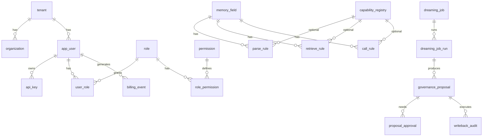

# Memory Engine MySQL 数据库表设计（完整版）

> 版本：v0.4 | 状态：已定稿（待连接串落地）  
> 字符集：`utf8mb4` / `utf8mb4_unicode_ci`  
> 库名：`memory_engine`

---

## 1. 设计约定

| 约定 | 说明 |
|------|------|
| **全局标准字段** | **每张表**均含 `deleted`、`create_time`、`update_time`（见 §1.1） |
| 多租户 | 所有业务表含 `tenant_id`；组织隔离含 `org_id` |
| 租户级资源 | `org_id = 0` 表示**仅租户级、无组织**（哨兵值，不关联 `organization` 表） |
| Schema 版本 | `memory_field` 软删除 + `version` 递增；**不与** parse/retrieve/call 规则联动 bump |
| 规则版本 | `parse_rule` / `retrieve_rule` / `call_rule` / `capability_registry` **各自独立版本链** |
| 外键 | `tenant_id` 可 FK 至 `tenant`；`org_id` **不设 FK**（因允许 0） |
| API Key | per-user；仅存 `key_prefix` + `key_hash` |
| 调用日志 | **不落 MySQL**；走 Kafka → 对象存储/日志服务（见 §10） |
| LLM 密钥 | `config_json` 使用 `api_key_secret_ref`，明文密钥不入库 |
| Canal | 热更新依赖 `update_time DATETIME(3)` |
| 外键 | 43 条 FK，详见 `foreign-keys-and-indexes.md` §2 |
| 索引 | 按 API 场景优化，详见 `foreign-keys-and-indexes.md` §4–5 |
| CHECK | `org_id >= 0`、`deleted IN (0,1)`、置信度/额度等业务约束 |

### 1.1 全局标准字段（23/23 表）

```sql
deleted     TINYINT(1)   NOT NULL DEFAULT 0 COMMENT '软删除: 0=有效 1=已删除',
create_time DATETIME(3)  NOT NULL DEFAULT CURRENT_TIMESTAMP(3) COMMENT '创建时间(UTC)',
update_time DATETIME(3)  NOT NULL DEFAULT CURRENT_TIMESTAMP(3)
                           ON UPDATE CURRENT_TIMESTAMP(3) COMMENT '更新时间(UTC)',
```

默认查询过滤 `deleted = 0`。`status` 等业务字段与 `deleted` 并存。

---

## 2. ER 关系



---

## 3. 表清单（23 张）

| # | 表名 | 说明 |
|---|------|------|
| 1 | tenant | 租户 |
| 2 | organization | 组织（`org_id` 业务值 ≥1；0 为哨兵不入此表） |
| 3 | app_user | 业务用户（Supabase 映射） |
| 4 | memory_field | 记忆 Schema 主表 |
| 5 | capability_registry | 能力注册中心 |
| 6 | parse_rule | 解析规则 |
| 7 | retrieve_rule | 检索规则 |
| 8 | call_rule | 引用规则 |
| 9 | permission | 权限点字典 |
| 10 | role | 角色 |
| 11 | role_permission | 角色-权限 |
| 12 | user_role | 用户-角色 |
| 13 | api_key | API Key |
| 14 | billing_event | 计费事件 |
| 15 | usage_quota | 用量额度 |
| 16 | billing_invoice | 费用账单 |
| 17 | dreaming_job | Dreaming 任务定义 |
| 18 | dreaming_job_run | 任务运行实例 |
| 19 | governance_proposal | 治理提案 |
| 20 | proposal_approval | 提案审批 |
| 21 | memory_lock | 记忆锁 |
| 22 | writeback_audit | 回写审计 |
| 23 | schema_changelog | Schema 变更审计（应用层/CDC 补充） |

---

## 4. 表结构明细

### 4.1 tenant

| 字段 | 类型 | 约束 | 说明 |
|------|------|------|------|
| id | BIGINT UNSIGNED | PK, AI | |
| tenant_code | VARCHAR(64) | UNIQUE, NOT NULL | 对外编码 |
| name | VARCHAR(255) | NOT NULL | |
| status | ENUM | NOT NULL, DEFAULT active | active / suspended / deleted |
| settings_json | JSON | NULL | 租户配置 |
| created_at | DATETIME(3) | NOT NULL | |
| updated_at | DATETIME(3) | NOT NULL | |

---

### 4.2 organization

| 字段 | 类型 | 约束 | 说明 |
|------|------|------|------|
| id | BIGINT UNSIGNED | PK, AI | 从 1 开始；业务中 **0 表示无组织** |
| tenant_id | BIGINT UNSIGNED | FK→tenant, NOT NULL | |
| org_code | VARCHAR(64) | NOT NULL | 租户内唯一 |
| name | VARCHAR(255) | NOT NULL | |
| status | ENUM | NOT NULL | active / suspended / deleted |
| deleted | TINYINT(1) | NOT NULL, DEFAULT 0 | 软删除 |
| create_time / update_time | DATETIME(3) | NOT NULL | 标准时间字段 |

**唯一索引**：`UNIQUE (tenant_id, org_code)`

---

### 4.3 app_user

| 字段 | 类型 | 约束 | 说明 |
|------|------|------|------|
| id | BIGINT UNSIGNED | PK, AI | |
| tenant_id | BIGINT UNSIGNED | FK→tenant | |
| org_id | BIGINT UNSIGNED | NOT NULL, DEFAULT 0 | **0=租户级用户** |
| supabase_user_id | VARCHAR(128) | NULL | Supabase UUID |
| email | VARCHAR(320) | NOT NULL | |
| display_name | VARCHAR(255) | NULL | |
| status | ENUM | NOT NULL | active / disabled |
| metadata_json | JSON | NULL | |
| deleted | TINYINT(1) | NOT NULL, DEFAULT 0 | 软删除 |
| create_time / update_time | DATETIME(3) | NOT NULL | 标准时间字段 |

**索引**：`(tenant_id, org_id, email)`、`(supabase_user_id)`

---

### 4.4 memory_field

记忆定义（Schema 主表）。对应 README `POST/GET /schema/*`。

| 字段 | 类型 | 约束 | 说明 |
|------|------|------|------|
| id | BIGINT UNSIGNED | PK, AI | |
| tenant_id | BIGINT UNSIGNED | NOT NULL | |
| org_id | BIGINT UNSIGNED | NOT NULL, DEFAULT 0 | 0=租户级 Schema |
| name | VARCHAR(255) | NOT NULL | 记忆名称 |
| description | VARCHAR(1024) | NULL | |
| value_type | ENUM | NOT NULL | string / number / boolean / json / array / text |
| match_method | ENUM | NOT NULL | 数据写入策略：OVERWRITE / APPEND / MERGE |
| storage_type | ENUM | NOT NULL | KV / VECTOR / KV_AND_VECTOR |
| version | INT UNSIGNED | NOT NULL, DEFAULT 1 | 更新时旧行 deleted=1，新行 version+1 |
| deleted | TINYINT(1) | NOT NULL, DEFAULT 0 | 软删 |
| created_by | BIGINT UNSIGNED | NULL | app_user.id |
| created_at / updated_at | DATETIME(3) | NOT NULL | Canal 热更新 |

**唯一索引**：`UNIQUE (tenant_id, org_id, name, version)`  
**查询当前有效**：`deleted=0` 且同名 `MAX(version)`

**版本独立**：修改 memory_field **不**自动 bump parse/retrieve/call 规则版本。

---

### 4.5 capability_registry

SDK 注册解析/检索/引用运行时能力。

| 字段 | 类型 | 约束 | 说明 |
|------|------|------|------|
| id | BIGINT UNSIGNED | PK, AI | |
| tenant_id | BIGINT UNSIGNED | NOT NULL | |
| org_id | BIGINT UNSIGNED | NOT NULL, DEFAULT 0 | |
| capability_name | VARCHAR(128) | NOT NULL | |
| module_name | VARCHAR(255) | NOT NULL | Python 模块 |
| service_name | VARCHAR(128) | NOT NULL | 函数/服务名 |
| rule_kind | ENUM | NOT NULL | parse / retrieve / call |
| slot_name | VARCHAR(128) | NULL | call 槽位 |
| config_json | JSON | NULL | LLM：base_url, model, api_key_secret_ref, prompt_template |
| last_seen_time | DATETIME(3) | NULL | SDK 心跳 |
| heartbeat_version | BIGINT UNSIGNED | DEFAULT 0 | |
| code_fingerprint | VARCHAR(64) | NULL | 离线扫描 |
| version | INT UNSIGNED | NOT NULL | **独立版本链** |
| deleted | TINYINT(1) | NOT NULL | |
| deleted | TINYINT(1) | NOT NULL, DEFAULT 0 | 软删除 |
| create_time / update_time | DATETIME(3) | NOT NULL | 标准时间字段 |

**唯一索引**：`UNIQUE (tenant_id, org_id, capability_name, rule_kind, version)`

---

### 4.6 parse_rule

| 字段 | 类型 | 说明 |
|------|------|------|
| id | BIGINT PK | |
| tenant_id, org_id | BIGINT | org_id 可为 0 |
| memory_field_id | BIGINT | FK→memory_field.id（绑定特定 version 行 id） |
| memory_field_name | VARCHAR(255) | 冗余，便于检索 |
| rule_name | VARCHAR(128) | |
| capability_id | BIGINT NULL | FK→capability_registry |
| rule_config_json | JSON | |
| priority | INT DEFAULT 0 | |
| version | INT | **独立版本链** |
| deleted | TINYINT | |
| created_at / updated_at | DATETIME(3) | |

**API**：`/schema/parse/*`

---

### 4.7 retrieve_rule

| 字段 | 类型 | 说明 |
|------|------|------|
| retrieve_method | ENUM | EXACT / REGEX / SEMANTIC / LLM |
| memory_field_id | BIGINT NULL | 隐式检索可为 NULL |
| memory_field_name | VARCHAR(255) NULL | |
| 其余 | | 同 parse_rule |

**API**：`/schema/retrieve/*`

---

### 4.8 call_rule

| 字段 | 类型 | 说明 |
|------|------|------|
| slot_name | VARCHAR(128) | prompt 槽位 |
| memory_field_id | BIGINT NOT NULL | |
| 其余 | | 同 parse_rule |

**API**：`/schema/call/*`

---

### 4.9 permission / role / role_permission / user_role

标准 RBAC。`role.tenant_id` 租户内角色；`permission` 全局字典。

预置权限码：

- schema:read / schema:write  
- data:read / data:write  
- parse:execute / retrieve:execute / call:execute  
- debug:list  
- billing:read  
- governance:approve / governance:apply  

---

### 4.10 api_key

| 字段 | 类型 | 说明 |
|------|------|------|
| tenant_id, org_id | BIGINT | org_id 可为 0 |
| user_id | BIGINT FK | per-user |
| key_prefix | VARCHAR(16) | 如 mos_xxxx |
| key_hash | VARCHAR(128) | bcrypt/argon2 |
| permissions_json | JSON NULL | 覆盖角色权限 |
| expires_at / revoked_at | DATETIME(3) | |
| last_used_at | DATETIME(3) | |

---

### 4.11 billing_event

异步计费事件（LLM 调用后发送）。

| 字段 | 说明 |
|------|------|
| event_id | CHAR(36) 幂等 |
| event_type | llm_completion / embedding / retrieve / parse |
| prompt_tokens / completion_tokens / total_tokens | |
| cost_amount / currency | |
| status | pending / processed / failed |
| trace_id | 链路 ID |

---

### 4.12 usage_quota / billing_invoice

- **usage_quota**：租户/组织/用户级 token 或费用月度额度  
- **billing_invoice**：Dashboard 账单聚合（period_month = YYYY-MM）

---

### 4.13 dreaming_job

| 字段 | 说明 |
|------|------|
| tier | LIGHT / REM / DEEP |
| source | system / user |
| engine | spark / flink |
| config_json | 阈值、窗口、审批策略 |
| cron_expr | 定时 |

---

### 4.14 dreaming_job_run

关联 Temporal：`temporal_workflow_id`、`temporal_run_id`。

---

### 4.15 governance_proposal

| 字段 | 说明 |
|------|------|
| proposal_uuid | CHAR(36) |
| target_type | memory_field / memory_data / parse_rule / retrieve_rule / call_rule |
| action | create / update / delete / merge / freeze |
| confidence_score | DECIMAL(5,4) |
| risk_level | low / medium / high |
| status | draft → pending_review → approved/rejected → applied/rolled_back |
| auto_apply | 仅低风险自动 |

---

### 4.16 proposal_approval / memory_lock / writeback_audit

- **proposal_approval**：人工审批记录  
- **memory_lock**：schema/data 只读锁或冻结锁  
- **writeback_audit**：经 Schema/Data API 回写的审计与 `rollback_deadline`

---

### 4.17 schema_changelog

应用层或 CDC 消费者写入的变更审计（非调用日志）。

---

## 5. 外键与索引（完整清单）

完整 **43 条外键**、**70+ 索引**、**CHECK 约束** 及 API 场景映射见：

**[`foreign-keys-and-indexes.md`](./foreign-keys-and-indexes.md)**

### 5.1 摘要

| 类别 | 数量 | 说明 |
|------|------|------|
| 外键 | 43 | 全部 `tenant_id` 引用 `tenant`；`org_id` 不建 FK |
| 唯一索引 | 18 | 含版本链、幂等 ID、API Key 前缀 |
| 普通索引 | 52+ | 租户前缀 + deleted + 业务列 |
| Canal 索引 | 12 | `update_time` 或热表专用 `idx_*_canal` |
| CHECK | 30+ | 数据完整性兜底 |

### 5.2 典型查询与索引

```sql
-- Schema.get 当前有效记忆（走 idx_mf_lookup_name）
SELECT * FROM memory_field
WHERE tenant_id = ? AND org_id = ? AND name = ? AND deleted = 0
ORDER BY version DESC LIMIT 1;

-- APISIX API Key 校验（走 uk_api_key_prefix）
SELECT * FROM api_key
WHERE key_prefix = ? AND deleted = 0 AND revoked_at IS NULL;

-- 计费 pending 消费（走 idx_billing_pending）
SELECT * FROM billing_event
WHERE status = 'pending' AND deleted = 0
ORDER BY create_time LIMIT 100;
```

---

## 6. Redis 缓存 Key（非 MySQL）

| Key | 说明 |
|-----|------|
| `mos:schema:{tenant}:{org}:{name}` | 当前有效 memory_field JSON |
| `mos:schema:{tenant}:{org}:{name}:deleted` | 软删过渡期 JSON，TTL 300s |
| `mos:cap:{tenant}:{org}:{capability_name}` | capability 快照 |

Delete 流程：MySQL deleted=1 → Redis deleted JSON (300s) → Canal → Kafka → Consumer DEL。

---

## 7. MongoDB / Qdrant（非 MySQL）

**MongoDB** 文档（memory data）：

```json
{
  "_id": "hash(tenant_id, org_id, user_id, memory_field_name)",
  "tenant_id": 1,
  "org_id": 0,
  "user_id": "u_xxx",
  "memory_field_name": "用户年龄",
  "value": {},
  "deleted": 0,
  "updated_at": "ISO8601"
}
```

**Qdrant**：collection `memory_vectors_{tenant_id}`；payload 含 org_id, user_id, memory_field_name, mongo_id。

---

## 8. API 调用日志（低成本存储）

**不写入 MySQL**。推荐架构：

```
FastAPI / APISIX
    → Kafka topic: api-call-logs
    → Flink 实时聚合（可选）
    → 对象存储（S3 兼容 / TOS）Parquet 分区存储 (dt, tenant_id)
    → Hive/Trino 查询 → Dashboard 监控页
```

字段规范（Parquet/JSON Lines）：

- tenant_id, org_id, user_id, api_key_id  
- http_method, path, status_code, latency_ms  
- trace_id, created_at  

---

## 9. 版本与更新语义

### memory_field.update

1. 将当前 `deleted=0` 行设 `deleted=1`  
2. INSERT 新行，`version = old.version + 1`  
3. **不修改** parse/retrieve/call_rule（除非显式调用对应 API）

### parse_rule.update（同理 retrieve/call）

1. 旧规则行 `deleted=1`  
2. 新规则行 `version+1`  
3. `memory_field_id` 指向当前有效的 memory_field 行（应用层保证）

---

## 10. 完整 SQL

| 文件 | 说明 |
|------|------|
| `backend/migrations/mysql/001_initial_schema.sql` | v0.4 全量建库（表 + FK + 索引 + CHECK + 种子数据） |
| `docs/database/foreign-keys-and-indexes.md` | 外键/索引/场景对照手册 |
